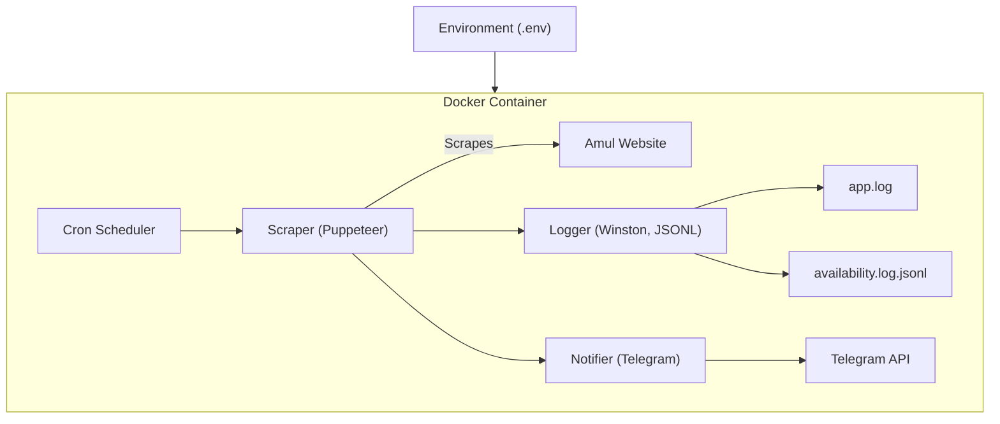

# Architecture Diagram


# Amul Protein Tracker

Track Amul protein product availability and receive Telegram notifications. Docker-ready, config-driven, and robustly logged for easy monitoring and deployment.

## Features

- Scrapes Amul protein product availability for configurable pincodes and products
- Sends notifications via Telegram when products are available
- Configurable via environment variables (Docker-friendly)
- Scheduled checks using cron (default: every 30 minutes, configurable)
- Robust application and availability logging (Winston, JSONL)
- Modular codebase for easy extension and maintenance

## Quick Start

### 1. Clone the repository

```sh
git clone https://github.com/jenil777007/Amul-Protein-Tracker.git
cd Amul-Protein-Tracker
```

### 2. Install dependencies

```sh
npm install
```

### 3. Configure environment variables

Copy `.env.example` to `.env` and fill in your values:

```sh
cp .env.example .env
```

Edit `.env`:

```
APT_TELEGRAM_BOT_TOKEN=your-telegram-bot-token
APT_TELEGRAM_CHAT_ID=your-telegram-chat-id
APT_PRODUCTS=High Protein Paneer,Whey Protein
APT_PINCODES=400001
APT_CRON_SCHEDULE=*/30 * * * * # every 30 minutes
```

### 4. Run locally

```sh
npm run start
```

### 5. Run with Docker

Build the image:

```sh
docker build -t amul-protein-tracker .
```

Run the container (scheduled checks):

```sh
docker run --env-file .env -e APT_DOCKER=true amul-protein-tracker
```

## Configuration

All runtime configuration is via environment variables:

- `APT_TELEGRAM_BOT_TOKEN`: Telegram bot token
- `APT_TELEGRAM_CHAT_ID`: Telegram chat/channel ID
- `APT_PRODUCTS`: Comma-separated product names
- `APT_PINCODES`: Comma-separated pincodes
- `APT_CRON_SCHEDULE`: Cron schedule (default: every 30 minutes)
- `APT_DOCKER`: Set to `true` when running in Docker (enables headless mode and disables sandbox)

## Logging

- Application logs: `logs/app.log`
- Availability logs: `logs/availability.log.jsonl` (JSONL format)

## Security Notes

- Secrets should never be committed or baked into Docker images
- `--no-sandbox` is required for Puppeteer in Docker; only use in trusted environments

## Troubleshooting

- If Puppeteer fails in Docker, ensure `APT_DOCKER=true` and `--no-sandbox` is set
- For Telegram issues, check bot token and chat ID
- For scraping issues, verify selectors and product names

## License

MIT

---

_Built and maintained by jenil777007_
